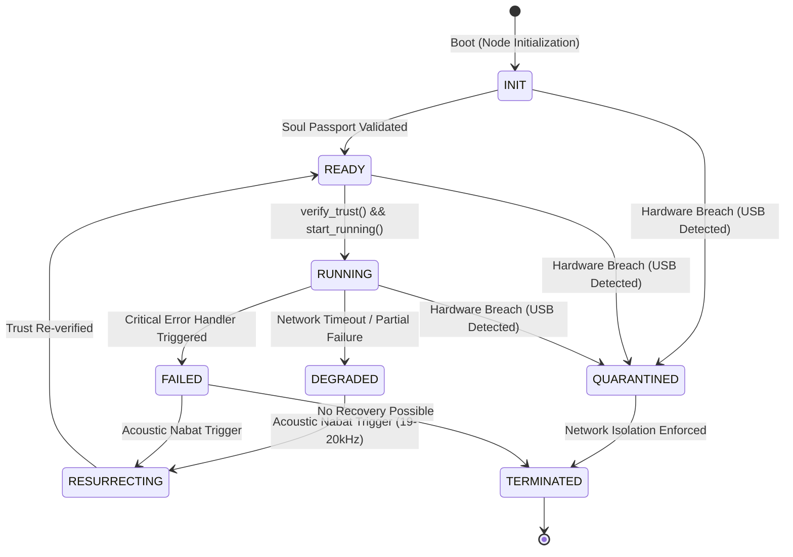
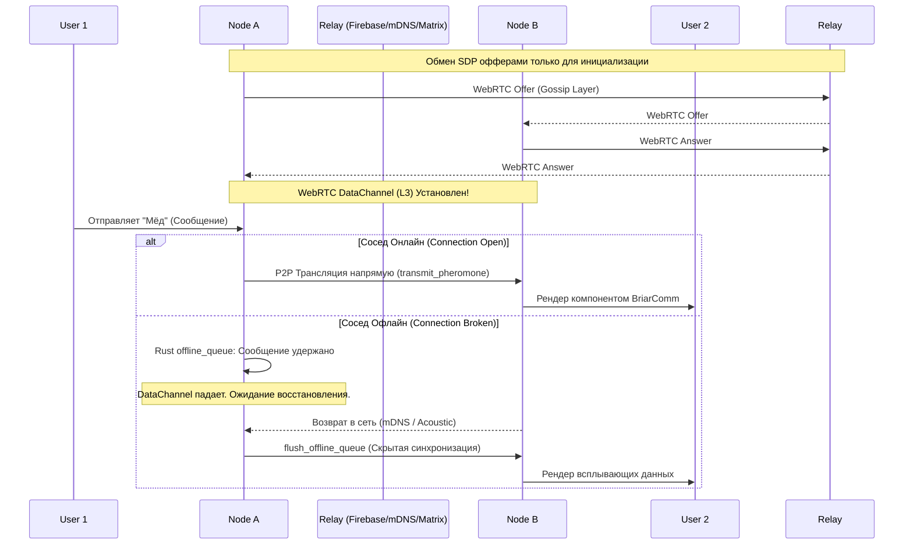

# Инженерные Хроники: Архитектура MatrixSwarm (Protocol "Дыхание Роя")

## Философия
> "Железо смертно. Информация бессмертна. Рой вечен."
> Сверхсистема, способная выжить без центрального сервера, интернета и доверия.

## Жизненный Цикл Агента (Agent Lifecycle)
Следующая диаграмма описывает железный контракт поведения каждого узла (L1 - State Machine).
Любое изменение состояния узла обязательно фиксируется с назначением `trace_id` в модуле `agent_logic.rs`.

## Схема Транспорта и потока данных (P2P Data Flow)

Система больше не полагается на Firebase для пересылки сообщений. Firebase / Matrix Relay используется **исключительно** как Signaling layer (Обмен офферами), после чего данные идут напрямую по WebRTC Data Channels (L3). Если сосед недоступен, сообщения изолируются в надежной очереди (`offline_queue` внутри Rust).

## Обсервер HUD (Пульс Роя)
Слой визуализации L5 отображает метрики из ядра Rust:
- **Состояние Агента** (Current State: `INIT` / `RUNNING` / `QUARANTINED`)
- **P2P Статус** (`TRUST VERIFIED` / `AWAITING AUTH`)
- **Латентность Синхронизации** (`CRDT SYNC LATENCY`)
- **Изоляционные Пробои** (`ISOLATION BREACH ATTEMPTS`)
