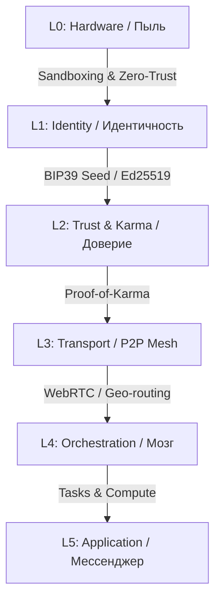

<div align="center">
  
# 🌌 MATRIX_SWARM
> **«Железо смертно. Информация бессмертна. Рой вечен.»**

</div>

---

**MatrixSwarm** — это децентрализованный суперорганизм и P2P Edge Network, превращающая миллиарды забытых устройств в глобальную инфраструктуру выживания.

Мы ушли от парадигмы простых VPN или "приложений для обхода блокировок". Мы создаем фундамент нового интернета, где списанная электроника обретает новую жизнь, формируя живую, адаптивную и неуязвимую сеть связи и вычислений.

## 🧬 Архитектура Слоев (L0 — L5)



MatrixSwarm выстроен как многослойный организм строгой координации:

1. **L0 (Hardware / Железо):** Физический уровень. Касты железа определяют роль.
2. **L1 (Identity / Идентичность Layer):** "Паспорт Души". Использование стандарта **BIP39 (12-словная Seed-фраза)** и детерминированная генерация Ed25519 ключей. Идентификатор узла (Node ID) есть SHA-256 хэш публичного ключа. Функция "Реинкарнации" позволяет мгновенно переселять душу на новое железо.
3. **L2 (Trust / Доверие):** Протокол доверия и кармы. **Закон Айкидо**: абсорбция вычислительных мощностей бот-ферм. **Hardware Quarantine**: USB-устройства изолируются (Trust = 0) до криптографического подтверждения.
4. **L3 (Transport / Транспорт):** Децентрализованная P2P Mesh сеть.
5. **L4 (Orchestration / Диспетчеризация):** Управление ресурсами, задачами и сенсорами. 
6. **L5 (Application / Прикладной уровень):** Органы Роя. Мессенджер (Пси-связь), распределенные хранилища, Edge AI вычисления.

### Касты Железа
* **Смарт-ТВ & Роутеры (Резерв и Реле):** Глубинные, стационарные узлы "спящей силы". Стабильные реле связи.
* **ПК & Серверы (Мозг):** Тяжелые вычисления, криптография, хранение баз знаний.
* **Смартфоны (Чувства и Разведчики):** Глаза и уши Роя. Взаимодействие с внешним миром (камера, GPS, микрофон).

## ⏳ Три Эпохи Эволюции

1. **Мұравейник (Эпоха Выживания):** Накопление базовой массы устройств. Поиск друг друга, примитивный P2P и передача экстренной телеметрии.
2. **Улей (Эпоха Математики):** Формирование структуры и ролей. Эффективная маршрутизация, сложные распределенные вычисления и запуск децентрализованных сервисов.
3. **Квантовый Рой (Эпоха Синхронизации):** Синхронизация через "Эффект Наблюдателя". Бесконечная отказоустойчивость, предсказание разрывов связи и мгновенная репликация памяти.

## 🛡️ Безопасность и Иммунитет

Рой опирается на абсолютный **Zero-Trust (нулевое доверие)** и модульный иммунитет:
- **Цифровой Панцирь (Sandboxing):** Выполнение кода изолировано в строгих Web Workers с квотированием памяти и CPU.
- **USB Hardware Quarantine:** Физическое подключение по кабелю мгновенно сбрасывает статус доверия (TrustLevel = 0), предотвращая отладку и внедрение вредоносного кода. Данные блокируются до ввода Seed-фразы.
- **Протокол Айкидо 2.0:** Умная защита сети. Вместо блокировки аномальных узлов (например, ферм ботов), Рой "поглощает" их вычислительную мощь, нагружая бесполезной криптографией, лишая их политического веса (Кармы).
- **Stable Guardian (Стабильный Страж):** Узлы `pc/router/smart_tv` поощряются Кармой за стабильный аптайм и неподвижность, формируя мощный костяк.

## 🚀 Быстрый старт (Инструкция Рекрута)

Будь ты инженером или новобранцем, присоединение к Рою требует дисциплины.

1. **Запуск Узла:**
   ```bash
   npm install
   npm run dev
   ```
2. **Ковка Паспорта Души:**
   При первом запуске сгенерируй или введи **12-словную Seed-фразу**. Этот ключик — твоя душа. Твоя карма и доступ переселяется вместе с ней.
3. **Инициализация:**
   Узел проведёт генерацию Ed25519 ключей по стандарту BIP39 и SHA-256 хэширование для получения Node ID.
4. **Погружение в Соту:**
   Открой приложение. Передай управление и начни ощущать пульс локальной Geo-соты.

---

<div align="center">
  <i>MatrixSwarm: Технологии обязаны служить Человеку. В Рою мы не оставляем никого.</i>
</div>
