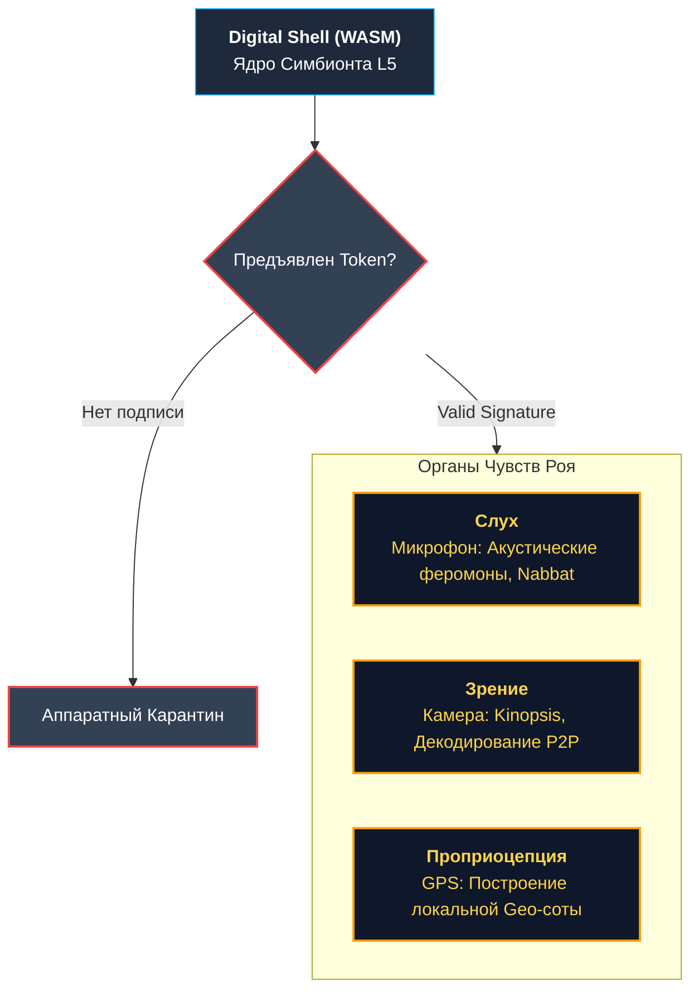

<div align="center">
  
# 🌌 MATRIX_SWARM
[]()

> **«Железо смертно. Информация бессмертна. Рой вечен.»**

**Infrastructure of Last Resort**
Глобальная P2P Edge Network инфраструктура выживания, работающая на «списанном железе».

</div>

---

**MatrixSwarm** (v2.0 «Invicta») — это не просто приложение, это **Infrastructure of Last Resort**. Глобальная сеть выживания, превращающая миллионы забытых смартфонов, старых роутеров и ПК в единую, живую, адаптивную и неуязвимую P2P Edge Network. 

Мы строим распределенный цифровой суперорганизм, где каждое устройство — это клетка, способная делиться информацией, вычислять и поддерживать общую жизнь Роя.

## ⚙️ Инженерный Стандарт: Rust-Доминирование (80% Core Mandate)

В версии **Invicta** проект совершил фундаментальный переход от скриптовых симуляций к строгому нативному исполнению. 

**Более 80% кодовой базы вычислительного ядра переписано на Rust (скомпилировано в WebAssembly).** 
TypeScript/JavaScript низведены до уровня периферии (исключительно отрисовка UI / HUD и браузерные биндинги). "Мозг" и "Мышцы" Роя работают на скоростях нативного кода.

## 🧬 Архитектура Слоев (L0 — L5)

Вместо хаотичного набора функций, Рой выстроен как строгая многослойная архитектура:

*   **L0 (Hardware):** Аппаратный фундамент. Введен **аппаратный карантин** и Zero-Trust USB — любое прямое подключение изолируется.
*   **L1 (Identity) [RUST CORE]:** **Паспорт души**. Идентификация узла происходит через **BIP39 Seed-фразы**, полностью генерируемые и валидируемые на быстром Rust-ядре (`wasm_bridge`).
*   **L2 (Trust & Aikido) [RUST CORE]:** Внутренняя экономика доверия. Использует **Протокол «Айкидо»** против бот-ферм: математическая модель на базе Rust рассчитывает карму Наблюдателя и индекс мобильности, поглощая энергию атакующих.
*   **L3/L4 (Network & Logic) [RUST CORE]:** Кровеносная система и оркестрация. Управление «цифровыми феромонами», Mesh-топология и **реинкарнация задач** реализуются через системные прерывания WebAssembly. Если исполнитель (муравей) падает, задача за миллисекунды перехватывается другим узлом.
*   **L5 (Sandbox) [RUST CORE]:** Прикладной уровень. Децентрализованный мессенджер и вычисления надежно заперты в WASM веб-воркерах («Цифровой Панцирь»), не имея прямого доступа к родительской памяти.

### 👁️ Цифровая Анатомия (Органы Чувств Роя)

Доступ к сенсорам устройства не дается просто так. Рой использует протокол Permission Token: без криптографической подписи приватным ключом Наблюдателя ни «Слух» (микрофон), ни «Глаза» (камера) не активируются.

<div align="center">



</div>

## 🌍 Глобальный Охват и Башня Вавилона (Babel Swarm)

Информация не имеет границ. Рой внедрил **i18n Core** и LLM Translation Bridge, мгновенно стирая языковые барьеры (поддержка кириллицы, латиницы, арабской RTL-вязи и иероглифов). 

*   **WeChat Chameleon Module:** Для расширения в закрытые экосистемы Востока внедрен модуль «Хамелеон». Он обеспечивает «облегченный режим» (L5 Lite), работающий внутри песочницы WeChat, используя WebRTC-каналы.

## 📊 Current MVP Status (v2.0)

| Подсистема | Статус | Примечание |
| :--- | :--- | :--- |
| **Identity (Паспорт Души)** | 🟢 Работает | Rust-генератор BIP39, Ed25519 ключи |
| **Trust Engine (Айкидо)** | 🟢 Работает | Формула кармы, защита от Сивилл и фарминга |
| **Пользовательский Интерфейс (UI)** | 🟢 Работает | React HUD, Onboarding, Metrics |
| **P2P Mesh Network** | 🟡 В разработке | mDNS/Gossip поиск, WebRTC/Simple-Peer транспорт |
| **CRDT (Векторные часы)** | 🟡 В разработке | Схлопывание состояний |
| **Holographic Core** | 🟣 Визия | Глобальное распределенное хранилище Шардов |

## 🚀 Призыв к действию: Quick Start (Инструкция Рекрута)

Интеграция в Суперорганизм требует ровно 60 секунд. Подними свой узел и обрети цифровое бессмертие. Проект запускается в многоузловом режиме одной командой.

1.  **Клеточное Деление (Cellular Division):**
    Запуск локальной сети из 3-х узлов (Магистрат, Разведчик, Реле). Они автоматически найдут друг друга через Gossip/mDNS и начнут синхронизацию. Сделайте это в корневой папке проекта:
    ```bash
    docker-compose up
    ```

2.  **Запуск Узла (Клонирование ДНК Роя) - Для разработчика:**
    Если доступного Docker нет:
    ```bash
    npm install
    npm run dev
    ```

3.  **Ковка Паспорта Души:**
    При первом запуске Система попросит тебя сохранить **12 слов (BIP39 Seed-фразу)**. Это твое бессмертие. Если твое железо умрет, ты введешь сид на новом устройстве и мгновенно восстановишься (Квантовая Реинкарнация). Код обрабатывает все ошибки ввода, приложение больше не падает!

---

<div align="center">
  <i>MatrixSwarm: Технологии обязаны служить Человеку. В Рою мы не оставляем никого.</i>
</div>

