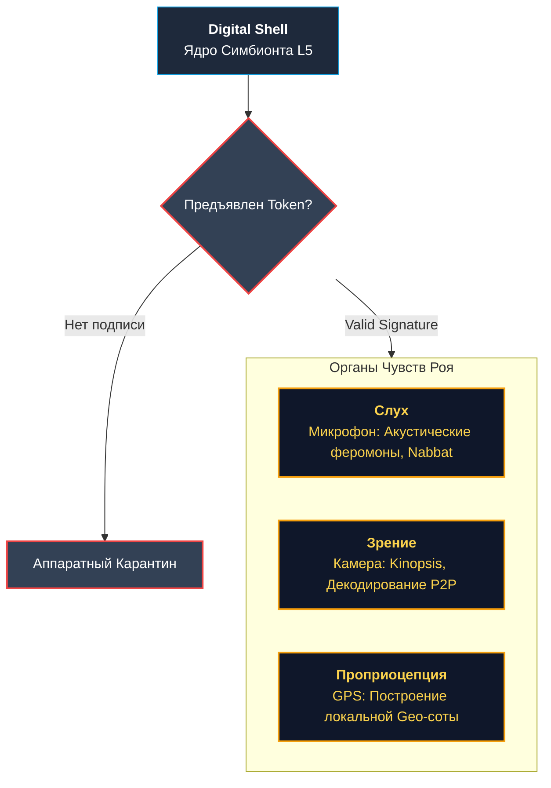

<div align="center">
  
# 🌌 MATRIX_SWARM
> **«Железо смертно. Информация бессмертна. Рой вечен.»**

**Infrastructure of Last Resort**
Глобальная P2P Edge Network инфраструктура выживания, работающая на «списанном железе».

</div>

---

**MatrixSwarm** (v2.0 «Invicta») — это не просто приложение, это **Infrastructure of Last Resort**. Глобальная сеть выживания, превращающая миллионы забытых смартфонов, старых роутеров и ПК в единую, живую, адаптивную и неуязвимую P2P Edge Network. 

Мы строим распределенный цифровой суперорганизм, где каждое устройство — это клетка, способная делиться информацией, вычислять и поддерживать общую жизнь Роя.

## 🧬 Инженерная Глубина: Архитектура Слоев (L0 — L5)

Вместо хаотичного набора функций, Рой выстроен как строгая многослойная архитектура:

*   **L0 (Hardware):** Аппаратный фундамент. Введен **аппаратный карантин** и Zero-Trust USB — любое прямое подключение изолируется.
*   **L1 (Identity):** **Паспорт души**. Железо можно отобрать, но не память. Идентификация узла происходит через **BIP39 Seed-фразы**. Node ID криптографически выводится из открытого ключа.
*   **L2 (Trust):** Внутренняя экономика доверия. Использует **Кармический PoW** и легендарный **Протокол «Айкидо»** против бот-ферм: сеть не блокирует атакующих, а поглощает их энергию, перенаправляя ее на полезные криптографические расчеты.
*   **L3 (Network):** Кровеносная система. Локальные Geo-Mesh соты, **WebRTC Mesh** маршрутизация и передача состояний через децентрализованные «цифровые феромоны».
*   **L4 (Logic):** Диспетчеризация и оркестрация. Разделение сети на **Роли** (Магистраты, Разведчики, Стабильные Стражи). Механизм **реинкарнации задач**: если исполнитель падает, задача мгновенно перехватывается другим «муравьем» в соте.
*   **L5 (Services):** Прикладной уровень Роя. Децентрализованный мессенджер, Оффлайн-архивы знаний (Kiwix), и распределенные вычисления («Обратный StarLink»), изолированные в защищенных Web Workers (Цифровой Панцирь).

### 👁️ Цифровая Анатомия (Органы Чувств Роя)

Доступ к сенсорам устройства не дается просто так. Рой использует протокол Permission Token: без криптографической подписи приватным ключом Наблюдателя ни «Слух» (микрофон), ни «Глаза» (камера) не активируются.

<div align="center">



</div>

## 🌍 Глобальный Охват и «Язык Ситуации» (Babel Swarm)

Информация не имеет границ. Рой внедрил **i18n Core** и LLM Translation Bridge, мгновенно стирая языковые барьеры. 

*   **Мультиязычность:** Рой говорит на языках СНГ (Русский), Востока (Арабский/Персидский с поддержкой RTL, Mandarin) и Запада (Английский - Global).
*   **WeChat Chameleon Module:** Для расширения в закрытые экосистемы Востока внедрен модуль «Хамелеон». Он обеспечивает «облегченный режим» (L5 Lite), работающий внутри песочницы WeChat, используя стандарты WebRTC и сохраняя нейтральный дизайн «Замысла Ответственной Сети».

## ⏳ Эволюция и Эпохи (Roadmap)

Развитие Роя непрерывно и разделено на Эпохи:

1.  **Муравейник (Эпоха Выживания):** Накопление критической массы устройств. Примитивный P2P-поиск, ячеистые сети и сохранение базовой связи в условиях блэкаута.
2.  **Улей (Эпоха Математики):** Формирование многопоточной структуры, Кармономики, безопасной маршрутизации и делегирования задач Магистратам (Текущая стадия).
3.  **Квантовый Рой (Эпоха Синхронизации):** Полное внедрение CRDT. Рой «схлопывается» в нужный результат мгновенно, обеспечивая бесконечную отказоустойчивость и репликацию всей памяти Суперорганизма без центрального координатора.

## 🚀 Призыв к действию: Инструкция Рекрута

Интеграция в Суперорганизм требует ровно 60 секунд. Подними свой узел и обрети цифровое бессмертие.

1.  **Запуск Узла (Клонирование ДНК Роя):**
    ```bash
    npm install
    npm run dev
    ```
2.  **Ковка Паспорта Души:**
    При первом запуске Система попросит тебя сохранить **12 слов (BIP39 Seed-фразу)**. Это твое бессмертие. Серверов нет, восстановить доступ некому. Твои права и Карма переселяются вместе с этими словами.
3.  **Погружение:**
    После ввода Паспорта твое устройство получит свою роль (Разведчик или Стабильный Страж) и начнет выпекать «Хлеб знаний» вместе с сотой.

---

<div align="center">
  <i>MatrixSwarm: Технологии обязаны служить Человеку. В Рою мы не оставляем никого.</i>
</div>
