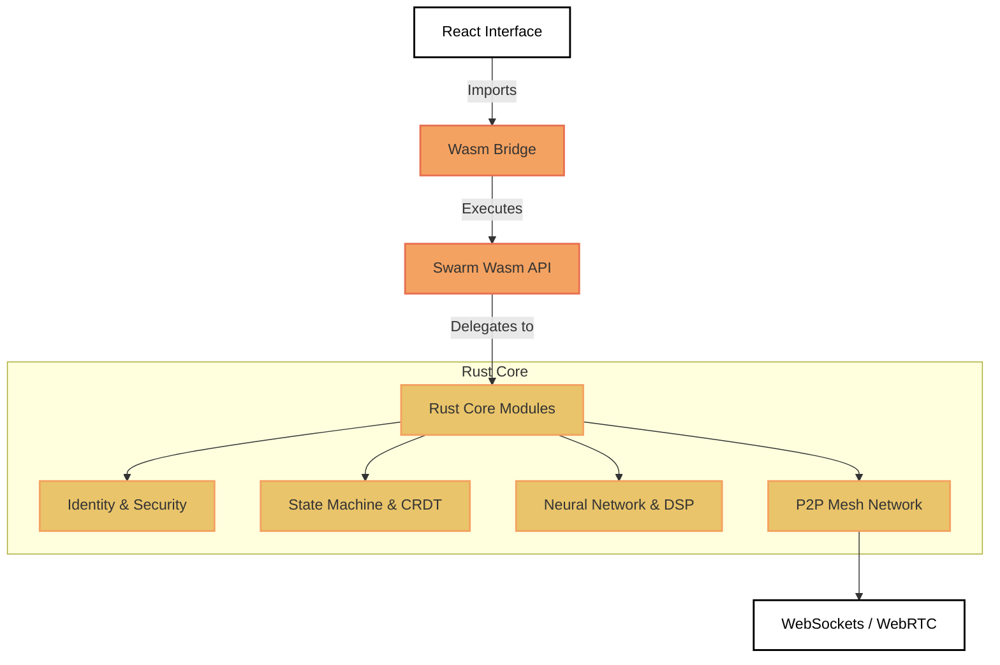
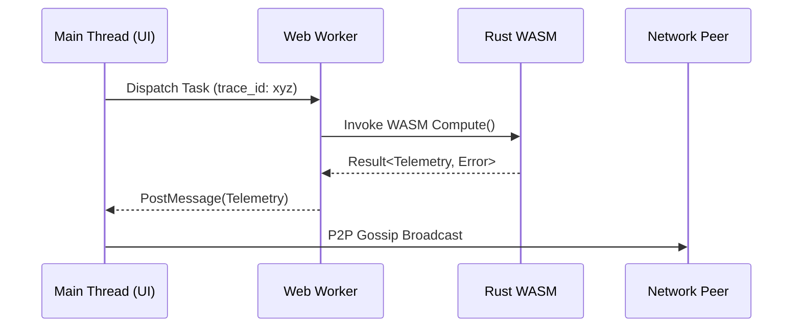
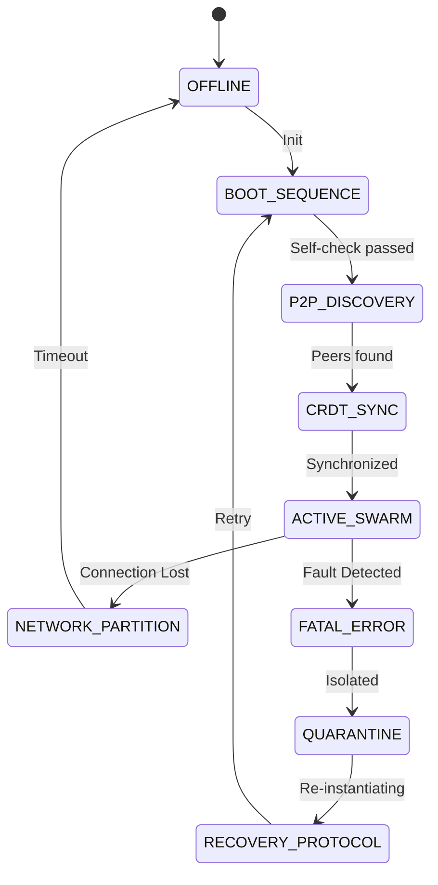

# MatrixSwarm Engineering Specification (v4.5)

## 1. Component Diagram (Rust Core & UI Integration)

## 2. Inter-Process Communication (IPC & Worker Map)

## 3. Recovery Graph (Node Resurgence)

